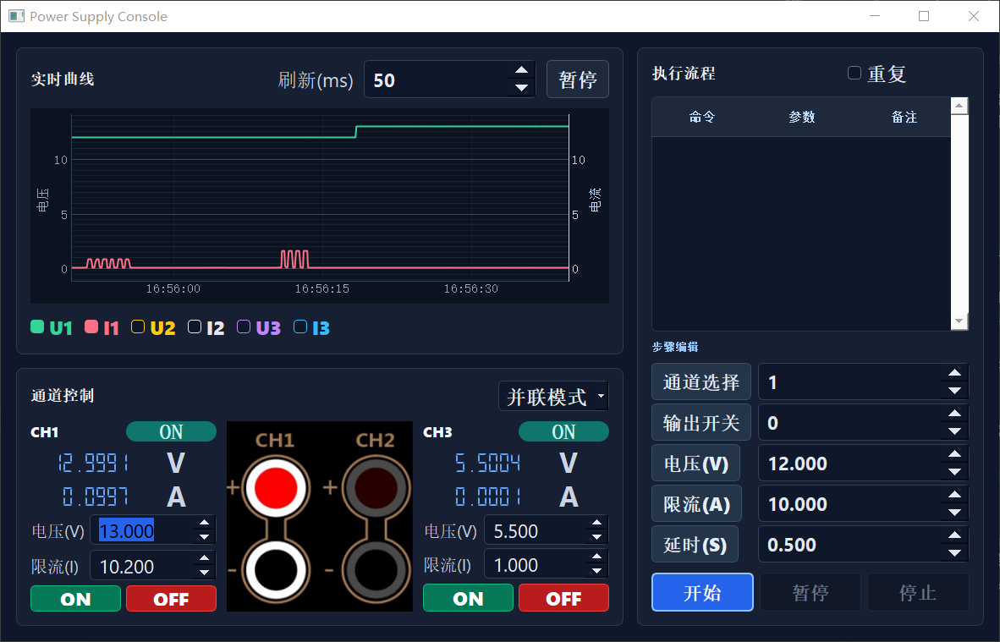

# PowerSupply

[中文](README.md)

PowerSupply is a PyQt5-based desktop control application for the NGI-N3412E programmable power supply. It communicates with the instrument over VISA/TCPIP and provides three-channel output control, real-time voltage/current plotting, step-based execution flows, and channel coupling modes.



## Features

| Feature | Description |
| --- | --- |
| Three-channel control | Control voltage, current limit, and output state for CH1, CH2, and CH3 |
| Real-time plotting | Display live voltage and current curves with pyqtgraph |
| Curve toggles | Show or hide U1/I1/U2/I2/U3/I3 curves independently |
| Step execution | Build ordered flows with channel, output, voltage, current, and delay steps |
| Flow controls | Start, pause, resume, stop, and repeat execution flows |
| Channel modes | Supports normal, parallel, series, and tracking modes |
| Status refresh | Periodically reads measured values, setpoints, and output states |
| Logging | Writes runtime logs to the `Logs/` directory |
| Windows packaging | Includes PyInstaller configuration and a one-click build script |

## Project Structure

| Path | Description |
| --- | --- |
| `PyqtPowerSupply.py` | Main entry point with UI logic, execution thread, and power-supply communication |
| `Ui_powerMainWindow.py` | Python UI module generated from the Qt Designer file |
| `powerMainWindow.ui` | Original Qt Designer UI file |
| `MyWidgets.py` | Custom widgets |
| `PyqtPowerSupply_log.py` | Logging module |
| `resource.qrc` / `resource_rc.py` | Qt resource file and generated resource module |
| `icon/` | UI icon assets |
| `PowerSupply.spec` | PyInstaller packaging configuration |
| `build.bat` | One-click Windows build script |
| `config.example.json` | Device connection configuration example |
| `requirements.txt` | Python dependency list |
| `LICENSE` | MIT License |

## Requirements

| Item | Recommendation |
| --- | --- |
| Operating system | Windows |
| Python | Python 3.8+ |
| GUI framework | PyQt5 |
| Instrument communication | PyVISA with an available VISA backend, such as NI-VISA or pyvisa-py |
| Packaging | PyInstaller |

## Install Dependencies

```bash
pip install -r requirements.txt
```

If you use NI-VISA as the backend, install NI-VISA Runtime first and make sure the instrument can be discovered by VISA.

## Device Connection

The application resolves the VISA resource address in this order:

| Priority | Source | Description |
| --- | --- | --- |
| 1 | `POWERSUPPLY_VISA_RESOURCE` environment variable | Useful for temporary device switching |
| 2 | Local `config.json` | Useful for a fixed development or lab setup |
| 3 | Built-in default | Defaults to `TCPIP0::172.16.40.214::7000::SOCKET` |

For first-time setup, copy the example configuration:

```bash
copy config.example.json config.json
```

Then update `config.json` for your device:

```json
{
  "visa_resource": "TCPIP0::172.16.40.214::7000::SOCKET"
}
```

Before running the application, check the following:

| Check | Description |
| --- | --- |
| Network | The PC and the power supply are reachable on the same network |
| IP/port | The device IP and port match the VISA resource address |
| VISA backend | PyVISA can open the TCPIP SOCKET resource |
| Terminator | The current read termination is `\r\n` |

## Run

```bash
python PyqtPowerSupply.py
```

The application initializes the device connection on startup. If the connection fails, an error dialog is shown and the program exits.

## Build

On Windows, run:

```bat
build.bat
```

The executable will be generated at:

```text
dist\PowerSupply.exe
```

You can also build manually:

```bash
pyinstaller PowerSupply.spec --noconfirm --clean
```

## Basic Workflow

| Step | Action |
| --- | --- |
| 1 | Make sure the power supply is powered on and reachable from the PC |
| 2 | Start `PyqtPowerSupply.py` or `dist\PowerSupply.exe` |
| 3 | Set voltage and current limit for CH1/CH2/CH3 |
| 4 | Use ON/OFF controls to switch channel outputs |
| 5 | Monitor voltage and current changes in the real-time plot |
| 6 | For automated operation, add steps in the execution-flow panel and click Start |

## Execution Flow Commands

| Command | Parameter |
| --- | --- |
| Channel | Selects the target channel for following steps |
| Output | `1` means ON, `0` means OFF |
| Voltage (V) | Sets the output voltage of the current channel |
| Current Limit (A) | Sets the current limit of the current channel |
| Delay (S) | Waits for the specified number of seconds before the next step |

## Notes

| Item | Description |
| --- | --- |
| Safety | Before operating real hardware, verify that the load, voltage, and current limits are safe |
| Local configuration | `config.json` stores local device settings and is ignored by `.gitignore` |
| Timing | Commands are handled with threads and queues; actual response time depends on instrument communication latency |
| Logs | The runtime log directory `Logs/` is ignored by `.gitignore` |
| Build artifacts | `build/`, `dist/`, and `__pycache__/` are not tracked |

## License

This project is licensed under the [MIT License](LICENSE).
